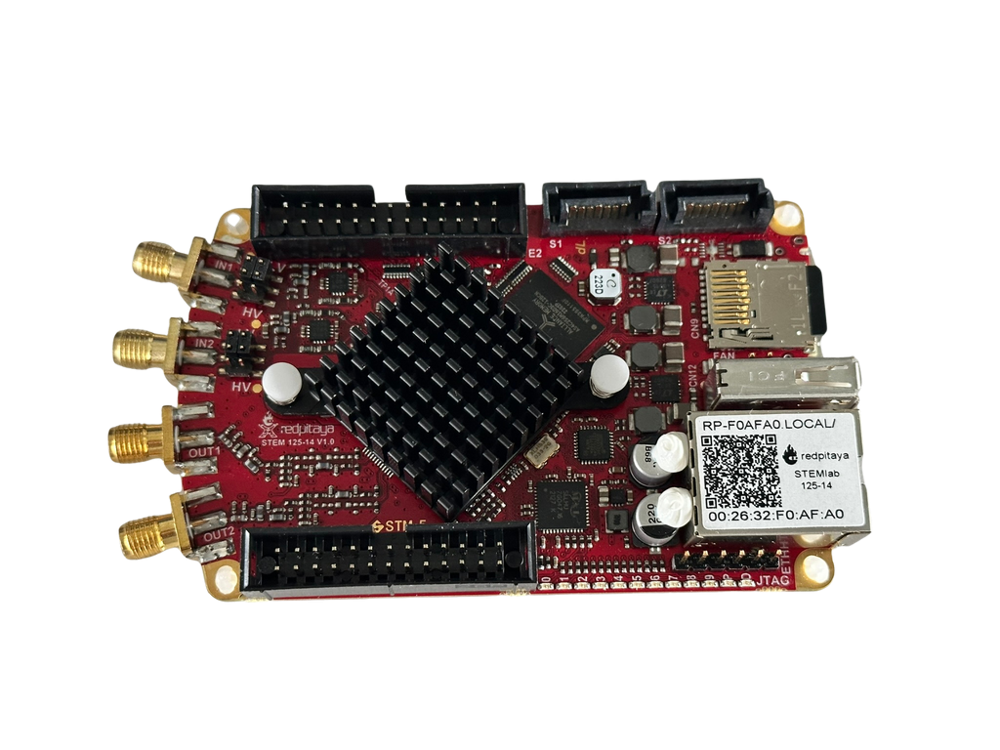
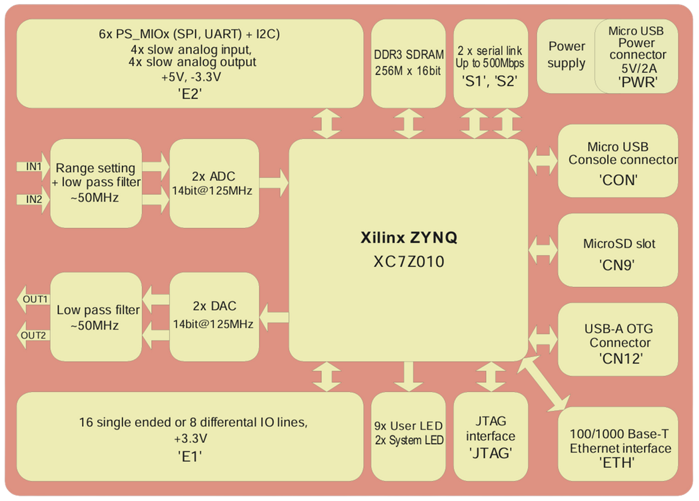

# Red Pitaya

## What This Section Covers

This section introduces the Red Pitaya STEMlab 125-14 board and explains how and why it is used.

You’ll find:

- **Why Red Pitaya? –** Why we need FPGAs alongside CPUs, and how hardware-level processing is faster than software.

- **Board Overview –** Physical layout and block diagram of the STEMlab 125-14.

- **Key Components:**

  - **Inputs** (ADCs, input ranges, low-pass filters, SMA connectors).

  - **Outputs** (DACs and output filtering).

  - **SoC core** (FPGA fabric + ARM Cortex-A9 processor).

  - **Memory and connectivity.**

  - **Expansion connectors** (GPIO, SPI, I²C, UART).

  - **Indicators** (LEDs).

- **How to interpret the diagrams –** How signals flow from the inputs through the FPGA to the outputs and CPU.

- **Summary –** Why this combination of fast hardware (FPGA) and flexible software (ARM/Linux) makes Red Pitaya valuable in labs and research.

## Why Use a Red Pitaya At All?

A normal computer uses a CPU. The CPU is general-purpose and can run any program, but comes at the cost of being slower. By contrast, an FPGA (field programmable gate array) is a reconfigurable hardware chip that allows us to perform computations directly in hardware which makes it much faster for specialised tasks. The Red Pitaya contains both a FPGA and CPU in one chip enabling high speed hardware control with software flexibility.  

## Why Software is Slower

A simple adder circuit (pure hardware) can add two binary numbers in ~500 ps[^1]. 

But when software says ```a = b + c``` , the CPU doesn't just add:

1. Fetch instruction (```ADD```) from memory.
2. Decode instruction.
3. Fetch operands ```b``` and ```c``` from registers/memory.
4. Send them through the adder circuit.
5. Store result in register/memory.
6. Increment the program counter and fetch the next instruction.

So while step 4 (the physical addition) is only 500 ps, the total time is longer due to instruction overhead: fetching, decoding, moving data and managing program flow.

Because CPUs are general-purpose, they need all this overhead to stay flexible. However this generality comes at the cost of raw speed. 

## Why hardware is Faster

When you design hardware for a specific task:

- You dont need to fetch instructions, decode them or ask what's next. 
- The hardware circuit is the operation itself. 

**Example:**

- A dedicated adder circuit: whenever two numbers arrive on its inputs, the sum instantly appears on its outputs. No fetch/decode/store cycle. 
- Data is arranged to flow through circuits in the right order, without extra control steps.

**Parallelism:**

If you need more throughput (the rate at which data is processed and transferred), you build more hardware:

- 10 adders -> 10 additions per cycle
- 1000 multipliers -> 1000 multipliers per cycle

Modern chips have billions of transistors, so massive parallelism at hardware level is possible. 

## Summary

**Software (CPU):**

Flexible, runs any program, but slower because of fetch-decode-execute cycle and memory overhead.

**Hardware (FPGA, ASIC):**
    
Faster, because the operation is wired directly, no overhead. But less flexible (unless you reconfigure an FPGA).

If hardware isn’t fast enough, you can just build more of it in parallel. CPUs can’t easily do that because they are designed to follow instructions sequentially.

## Red Pitaya

### STEMlab 125-14 Gen 1 board:



*Figure 1: Red Pitaya STEMlab 125-14*

### Block Schematic:



*Figure 2: Red Pitaya STEMlab 125-14 block diagram, from Red Pitaya Schematics v1.0.1 [^2].*


## Key components

The following explanations are based on the official Red Pitaya Schematics v1.0.1 [^2], with additional commentary for clarity.

### Inputs (IN1, IN2):
- **2x ADC 14 bit@125 MHz:**
    - The Red Pitaya has two **Analogue-to-Digital Converters (ADCs)**. These devices take an analogue signal (a continuously varying voltage, like a sine wave) and turn it into digital numbers that can be processed by the FPGA.
    - **14-bit resolution:** each sample is represented by one of 16,384 possible values, giving fine precision.
    - **125 MS/s sample rate:** the ADC captures 125 million snapshots per second. This means it can accurately follow signals with frequencies up to tens of MHz.

- **Range Setting:**
    - The ADC can only accept signals within a certain input range (**±1V or ±20V** depending on configuration).
    - **What happens if input is too big?** If your Red Pitaya is set to ±1V range, but you feed it a 5V peak signal. The ADC cannot represent values outside of -1V to +1 V. So everything above +1V gets "flattened" to +1V, and everything below -1V gets flattened to -1V. This is called saturation or clipping.
    - **What happens if input is too small?** If you have a 0.1V, but the ADC range is ±20V, the signal only uses 0.2V/40V = 0.5% of the ADC's available "steps." 14-bit -> 2¹⁴ = 16,384 steps across the full range and in our case the signal would only be using 82 steps. Your resolution is wasted. Imagine using a zoomed out camera to scan a really small object - it will appear as a blurry dot because you didn't use all the available pixels.
    - There are **jumpers** near the ADC and DAC inputs/outputs which you can change to select between ±1V mode (2 Vpp window, high resolution) and ±20V mode (40 Vpp window, lower resolution but can handle larger signals). The ADC always works with an input swing of about ±1 V. In ±1 V mode, the signal is fed directly. In ±20 V mode, a front-end attenuator first scales ±20 V down to ±1 V, so the ADC still sees the correct range without saturating.
    - Have a look at the [Analog Input Page from the Red Pitaya Docs](https://redpitaya-documentation.readthedocs.io/en/latest/developerGuide/hardware/125-14/fastIO.html) for a visual on how to change the jumpers.

- **Low-Pass Filter (~50 MHz):**
    - **Low-pass filter** allows low frequencies through and blocks high frequencies.
    - In the Red Pitaya's case signals below ~50 MHz pass cleanly, signals much above 50 MHz get strongly attenuated.
    - This is because of **Nyquist sampling theorem** which tells you how fast you need to sample a signal so that you can represent it accurately in digital form. 
    - If you sample at a rate $f_{s}$, the maximum frequency you can capture without distortion is half of that: $f_\text{max} = \frac{f_s}{2}$. This half-frequency is called the Nyquist frequency. 
    - In Red Pitaya, the sampling rate is 125 MS/s so the Nyquist frequency is 62.5 MHz. Any signals below this can be digitised faithfully and any frequency above this will fold back into lower frequencies, creating false signals (aliasing). 
    - The 50 MHz cutoff ensures only valid signals enter the ADC.

- **SMA Connectors:**
  - The gold connectors on the Red Pitaya board are SMA connectors. These are a type of coaxial connector that carry signals inside a shielded cable, commonly used in RF and test equipment.
  - For the inputs (IN1 and IN2), on sheet 3 of 9 of the Red Pitaya Schematics v1.0.1[^2], the schematic shows that there is no fixed 50 Ω termination built in. Instead, they are designed with a high input resistance (1 MΩ) so you can connect different types of sources. If you need proper impedance matching (e.g., connecting to a 50 Ω signal generator), you may need to add a 50 Ω terminator externally.
  - For the outputs (OUT1 and OUT2), the schematic clearly shows a built-in 50 Ω termination, which is explained below in the Outputs (OUT1, OUT2) Section.

- **[SMA connector] → [Range setting circuit (jumpers)] → [Low-pass filter] → [ADC chip]**

### Outputs (OUT1, OUT2):  
- **2x DAC 14-bit@125 MHz:** 
    - The Red Pitaya has two **14-bit Digital-to-Analogue Converters (DACs)** running at **125 MS/s**. 

- **Low-Pass Filter (~50 MHz):**
    - A DAC generates signals by updating the output voltage at discrete steps (every 8 ns at 125 MS/s) which won't produce a perfectly smooth waveform.
    - If you tell it to generate a 10 MHz sine wave, what you actually get is a staircase approximation of that sine wave which contains the low frequency component (the 10 MHz sine) and lots of unwanted high-frequency componenets.
    - The ~50 MHz low-pass filter after the DAC blocks the high-frequency componenets and ensures the output is a clean analogue signal.

- **SMA Connectors:**
  -  On sheet 4 of 9 of the Red Pitaya Schematic v1.0.1[^2], the outputs (OUT1 and OUT2) are shown with a built-in **50Ω termination**
  - For reliable measurements, all parts of your setup should use the same impedance (e.g. generator 50Ω → cable 50Ω → oscilloscope 50Ω). This is called impedance matching.
  - Say you have a mismatch (e.g. the Red Pitaya outputs a 50Ω signal but your oscilloscope input is 1 MΩ):
    - Part of the signal is absorbed
    - Part will be reflected back down the line
    - This causes ringing, standing waves and wrong amplitudes on your oscilloscope

    - Analogy: when your red pitaya acts as a signal generator, it is like a water pump. It expects to pump water into a pipe system (the coax cable) with a known resistance.
    - At the other end, the oscilloscope input should act like a wide-open drain that accepts the flow steadily (also 50Ω). 
    - If the scope looks like an infinite wall (1 MΩ), the water has nowhere to go and so part of the wave gets reflected.
  - In practice: the generator produces a waveform, but the scope displays the wrong amplitude (often doubled). You might also see ringing or distortion because the signals keep bouncing back and forth. If your scope has a different impedance you will have to terminate it with 50Ω. If your scope does not have a built in option to set the channel input to 50Ω, you will need to attach a **50Ω feed-through terminator to the input.**

### SoC Core (Xilinx Zynq XC7Z010):
- **FPGA fabric (programmable logic):**
  - Digital systems are built from logic circuits (AND, OR, NOT gates).  
  - In a normal CPU, these circuits are fixed in silicon. You can only run programs using the built-in instruction set.
  - In an FPGA, the circuits themselves are programmable.  
  - The chip contains thousands of configurable blocks and reconfigurable wiring.  
  - A configuration file (bitstream) tells the FPGA how to wire these blocks together.  
  - Once loaded, the FPGA becomes the circuit you designed.
  - This offers flexibility, parallelism, speed and prototyping without making new silicon.

- **ARM Cortex-A9 processor:** 
  - The ARM Cortex-A9 inside the Zynq SoC is the CPU. [^3]
  - It runs a lightweight Linux distribution (Red Pitaya OS), which makes the board programmable and user-friendly.
  - The CPU is responsible for tasks that are too slow, too complex, or too high-level for the FPGA:
    - File I/O: saving ADC data to the SD card, loading FPGA configurations, reading/writing logs.  
    - Networking: running the web interface, SSH access, sending data over Ethernet using TCP/IP.  
    - Control software: executing Python/C programs that orchestrate experiments (deciding when to collect data, how to process it, when to reconfigure the FPGA).  
  - It acts as a bridge between the FPGA and the outside world:  
    - The FPGA processes data in real time.  
    - The CPU collects that data from shared memory and delivers it to files, network sockets, or user applications.  

- **FPGA does the nanosecond hardware work; the CPU makes the results accessible and manageable.**

### Memory:  
- 256 MB DDR3 SDRAM, connected to the SoC.  
- Used for storing data, running Linux, and buffering signals.

### Connectivity:
- **Ethernet (ETH):** remote control and data transfer over the network.  
- **USB-A OTG (CN12):** for peripherals.  
- **Micro USB (PWR):** 5 V / 2 A power input.  
- **Micro USB (CON):** console/debugging via UART.  
- **MicroSD slot:** holds the Red Pitaya OS (Linux distribution).  

### Expansion I/O:

Click on the link to go to the image of the [extension connectors](https://redpitaya.com/rtd-iframe/?iframe=https://redpitaya.readthedocs.io/en/latest/developerGuide/hardware/hardware.html)

- **E1 connector:** 
  - 16 single-ended or 8 differential GPIO lines (3.3 V)[^4].
  - GPIO stands for General Purpose Input/Output. These are digital pins:
    
    Configurable as inputs (reads 0/1) or output (drives a 0/1).

  - If you use them as single-ended, you get 16 independent digital lines (each one referenced to ground).
    
    These are good for low-speed control signals, LEDs, switches, basic digital I/O.
  - If you use them as differential pairs, each signals uses two wires (one carries the "positive" version and the other carries the "negative" version and the reciever looks at the difference between the two wires, not their voltage to ground). 
    
    This is better for noise immunity (common interference affects both wires equally so when you subtract the two, the noise also cancels out), signal integrity and high speed.
  - The 3.3V means that logic high is approximately 3.3 V and logic low is 0V. **Important:** If you connect external hardware, it must also be 3.3V logic compatible. Connecting higher-voltage logic (e.g. 5 V) risks damaging the FPGA.

- **E2 connector:** slow analogue I/O, I²C, SPI, UART, and external clock.  
- **JTAG:** debugging and FPGA programming interface.  

### Indicators:
- 9 user LEDs and 2 system LEDs for status and debugging.  

## Physical Layout

The [annotated board image](https://redpitaya.readthedocs.io/en/latest/intro.html) in the link shows where the main components are located on the board:

- **RF inputs (IN1, IN2):** SMA connectors on the front panel → ADC → FPGA.  
- **RF outputs (OUT1, OUT2):** SMA connectors on the front panel ← DAC ← FPGA.  
- **Ethernet:** remote access and data streaming.  
- **Micro USB (Power):** supplies 5 V to the board.  
- **Micro USB (Console):** serial debugging.  
- **MicroSD slot:** OS storage and boot.  
- **GPIO and Extension connectors:** allow additional modules and custom peripherals.  
- **Zynq SoC (FPGA + ARM):** located under the heatsink at the centre of the board.

---

## How to interpret this

- The FPGA is not a separate chip – it is part of the Zynq SoC (under the heatsink).  
- Data from the ADC inputs flows directly into the FPGA, where you can design high-speed digital processing pipelines.  
- Processed data can then be sent to the DAC outputs, or transferred to the ARM processor for higher-level software access.  
- The ARM processor makes it easy to communicate with the outside world (Ethernet, USB, Linux applications), while the FPGA ensures speed and parallelism.  

---

## Summary

The Red Pitaya STEMlab 125-14 provides:

- **Fast signal acquisition and generation** via high-speed ADCs and DACs.  
- **Flexible processing** using the FPGA fabric for parallel hardware tasks.  
- **Accessible control and programming** via the ARM processor running Linux.  

This combination makes the board ideal for applications where high-speed hardware control must be paired with software flexibility – exactly the reason it is used in laboratory and research environments.


## References

[^1]: ECE253: Digital and Computer Systems, Lecture 1, Prof. Natalie Enright Jerger, University of Toronto

[^2]: Red Pitaya d.o.o. *Red Pitaya Schematics v1.0.1*. Available at: https://downloads.redpitaya.com/doc/Red_Pitaya_Schematics_v1.0.1.pdf 

[^3]: AMD Xilinx. *Zynq-7000 SoC Technical Reference Manual (UG585)*. Version 1.13.1, July 2023. Available at:https://docs.amd.com/r/en-US/ug585-zynq-7000-SoC-TRM/Zynq-7000-SoC-Technical-Reference-Manual

[^4]: Red Pitaya d.o.o. *Hardware*. Available at: https://redpitaya.readthedocs.io/en/latest/developerGuide/hardware/hardware.html