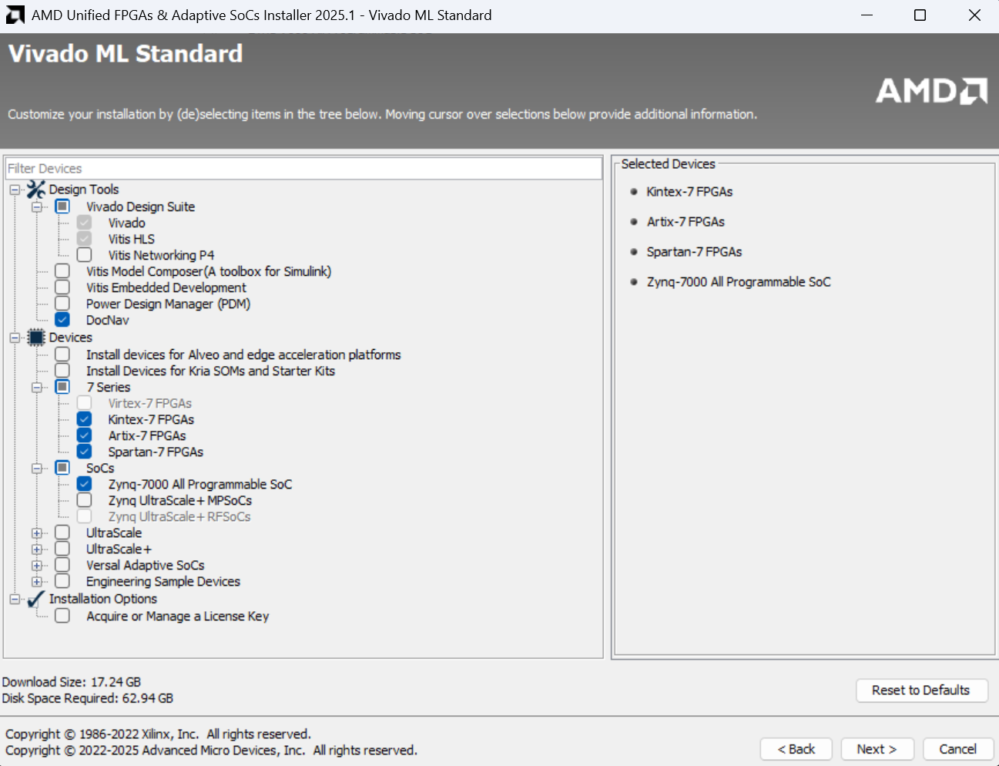
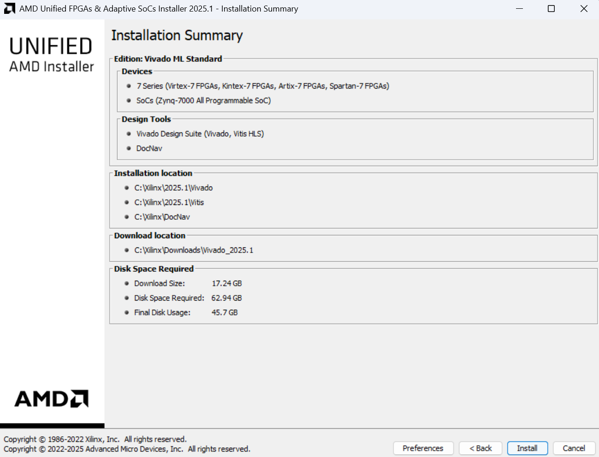

# Setup Guide

## What This Section Covers:

This guide explains how to set up the tools you need to start working with the Red Pitaya FPGA projects. 

It covers:

- **Vivado Installation:**
  - Which version to install and why.
  - Step-by-step instructions for downloading and installing Vivado 2025.1.
  - Which device families to select (7 Series + Zynq-7000 SoC).
  - Notes on disk space, optional tools like DocNav, and system-wide install settings.

- **Opening a New Project:**
  - How to use Tcl scripts (make_cores.tcl, make_project.tcl) to quickly create a Vivado project.
  - Where cores go, and how to add extra ones (e.g. from Pavel Demin’s repository).
  - What IP cores are and why they matter.

- **Connecting to Your Red Pitaya:**
  - Links to the official quick start guide for powering and connecting your board.

- By the end, you’ll have Vivado installed, know how to generate a Red Pitaya project, and understand the role of IP cores and setup scripts.

## Vivado Installation

During my internship, I was using Vivado 2020.1 but that was because the official Red Pitaya repositories which I initially used to learn were written/tested for Vivado 2020.1. However, I would recommend you to download the latest version of Vivado. Below is installation guidance for 2025.1.

### 2025.1:

1. Go to [AMD's downloads webpage](https://www.xilinx.com/support/download/index.html/content/xilinx/en/downloadNav/vivado-design-tools.html)
2. Scroll down to  AMD Unified Installer for FPGAs & Adaptive SoCs 2025.1: Windows Self Extracting Web Installer (EXE - 226.04 MB) and click it to start download.
3. You'll be taken to Sign-in page. Create an account if you don't have one, it is free and sign in. You'll then be asked to input some information about yourself, after which you can click on the "Download" button at the botton of the page to start the download.
4. Follow the instructions to set it up. You'll be taken to a welcome page, click "Next >", put your AMD details in and select "Download and Install Now."
5. Select Vivado as the product to install.
6. Select Vivado ML Standard as the edition to install.
7. When installing Vivado, you are asked to choose which FPGA device families to support. For Red Pitaya (STEMlab 125-14), you need to select:
    - 7 Series → The FPGA fabric inside the Red Pitaya (XC7Z010) belongs to the Xilinx 7 Series family.  
  This includes Artix-7, Kintex-7, Virtex-7, Spartan-7, and Zynq-7000 devices.  
  The programmable logic (FPGA part of the chip) is built using this 7-series architecture.
    - SoCs (Zynq-7000 All Programmable SoC) → The Red Pitaya uses a Zynq-7000 SoC.  
    This combines:
        - An ARM Cortex-A9 processor (runs Linux, user programs, networking, file I/O).  
        - A 7 Series FPGA fabric (handles high-speed, parallel computations).  

    By selecting both 7 Series and SoCs, you ensure Vivado installs all the device libraries and IP cores needed to work with the Red Pitaya’s Zynq-7000 chip. 

    It does take up a lot of space - ~45-65 GB. If you are trying to save as much space as possible you can de-select DocNav, it is just an offline document viewer from AMD/Xilinx which you can access on their website or install later if you wish.

    

8. On the next page, you'll be asked to accept some license agreements.
9. On the Select Destination Directory section, select **All users** under "Apply shortcut & file association selection to" so every user account on your computer can use Vivado without re-installing. It doesn't really matter if you're the only user of your laptop.
10. Find below the install summary, click install. It will take a while to install!


## Opening a New Project

[1. Download the Final Vivado Folder](https://github.com/Bentwin2002/Group_IV_RP/tree/1916aeb4dfb7fd2a1658bcffc84c78c3ad14fbd9/Final_Vivado)

2. Open Vivado and in the Tcl Console, `cd` to where you saved the template

3. Run the commands:

    ```
    source make_cores.tcl
    source make_project.tcl
    ```

- These Tcl scripts automate the setup:
  - `make_cores.tcl` packages everything inside the `/cores` folder into a local IP repository (`tmp/cores`).
  - `make_project.tcl` then creates a new Vivado project in the tmp/ folder, links in that IP repository, and builds the base block design.
  - A new folder (e.g. `tmp/project_name/`) will be created which contains the Vivado project files. You can open the project later by double-clicking the `.xpr` file inside.
  - If you want to start fresh, either delete the tmp folder or copy the template repository to a new location before running the scripts again. I would make a copy of the clean template and duplicate it for a new project.
- Renaming projects: If you want to change the project name, open `make_project.tcl` (not make_cores.tcl) and edit the line:

  ```
  set project_name your_project_name
  ```

- What are cores?
  - Cores are pre-packaged hardware modules (IP cores) that you can drag into your block design instead of writing HDL from scratch. In Pavel Demin’s repository you’ll find Red Pitaya-specific cores such as adc and dac, which provide ready-made building blocks for reading from the ADC or driving the DAC.
*This will make more sense once you go through the later sections and actually see them in the block design.*

**You don't have to understand the below if you are a beginner, feel free to skim and just continue onto connecting to your Red Pitaya**

### Adding Extra Cores

- Older resources say you can include extra cores — for example from [Pavel Demin’s repository](https://github.com/pavel-demin/red-pitaya-notes/tree/master/cores) — by:
  - Copying the desired core into `/cores/`.
  - Re-running:
  ```
  source make_cores.tcl
  source make_project.tcl
  ```
- This rebuilds the IP repository and regenerates the project with the new cores included.
- *I haven't actually tried this so be wary*
### If the core has only Verilog files

- In Pavel’s current repo, many cores are only Verilog files so I am not sure the above method will still work because I think you need a `core_config.tcl`. If that’s the case, you can still use the Verilog directly:
  - Start a new Vivado project (or open an existing one).
  - In the Project Manager panel, select Add Sources.
  - Choose Add or Create Design Sources.
  - Create a new file, give it a name, and click Finish.
  - Confirm with OK.
  - In the Sources window, double-click the new file and paste in the Verilog code for the module.
  - To bring it into your block design, right-click inside the block diagram and select Add Module.

## Connecting your Red Pitaya

There are multiple ways to connect to the Red Pitaya which is detailed [here](https://redpitaya.readthedocs.io/en/latest/quickStart/first.html)

I did it through an ethernet cable connection to my laptop.

## Acknowledgements & References

This setup guide is adapted from internal Red Pitaya notes by M. Barendregt (2022) and B. Millward (2023), written within the Kagome Lattice subgroup of the MBQD group at the University of Cambridge during their Red Pitaya projects.

### References
- M. Barendregt, *Red Pitaya*, Kagome Lattice – MBQD Group, University of Cambridge, Internal Notes, Summer 2022. Retrieved from Kagome Wiki. Available at: [https://wiki.cam.ac.uk/kagome/Red_Pitaya](https://wiki.cam.ac.uk/kagome/Red_Pitaya)  
- B. Millward, *Red Pitaya Guide*, Kagome Lattice – MBQD Group, University of Cambridge, Internal Notes, 2023. Retrieved from Kagome Wiki. Available at: [https://wiki.cam.ac.uk/kagome/Red_Pitaya](https://wiki.cam.ac.uk/kagome/Red_Pitaya)
- AMD. *Vivado Design Tools – Downloads Page*. Available at: [https://www.xilinx.com/support/download/index.html/content/xilinx/en/downloadNav/vivado-design-tools.html](https://www.xilinx.com/support/download/index.html/content/xilinx/en/downloadNav/vivado-design-tools.html)
