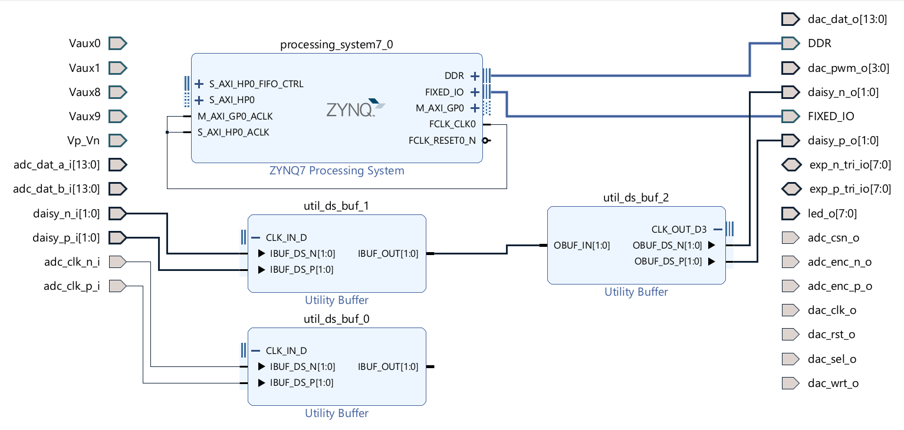
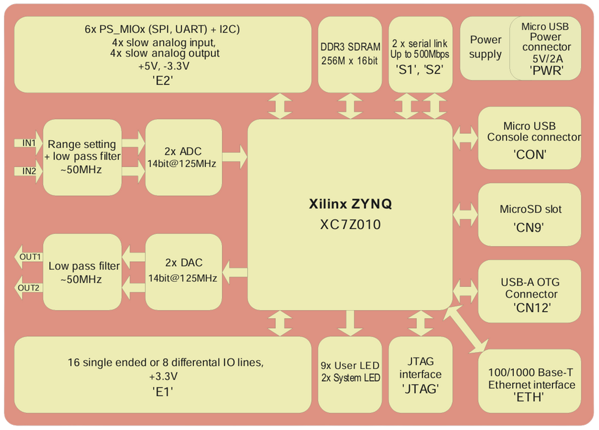
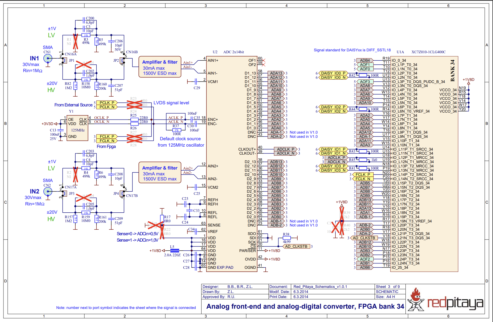

# Vivado Overview: Mapping Red Pitaya Hardware into Vivado

## What This Section Covers:

This document introduces how Vivado represents the Red Pitaya FPGA design. 

It covers:

- **Block Design Basics:** what you see when you first open a project and how the diagram is structured.

- **Ports and Pins:** how signals flow into/out of the FPGA, and how they map to physical package pins.

- **IP Cores (Blue Blocks):** reusable hardware modules, both built-in (like the `Zynq7 Processing System`) and Red Pitaya–specific ones (like `ADC/DAC` cores).

- **Processing System (PS) vs Programmable Logic (PL):** how the ARM CPU and FPGA fabric communicate.

- **Clocks:** what clock signals are, why they matter, and where `FCLK_CLK0` fits in.

- **ADC and Daisy Ports:** how analogue signals are digitised and how multiple boards can be chained.

- **Utility Buffers:** why they’re inserted automatically in the design.

- **Constraint and Tcl Files:** how Vivado maps real Red Pitaya hardware connections into your project files.

- **Schematics Walkthrough:** step-by-step mapping from SMA connectors → ADC chip → FPGA pins.

- **Example Constraint (`ports.xdc`):** showing how logical ports (like `adc_dat_a_i[0]`) are tied to specific FPGA pins (like `V17`).

- **By the end of this section, you should have a clear mental map of how the physical Red Pitaya board is represented inside Vivado, and how schematics, block diagrams, and constraint files all fit together.**

## Block Design Basics

To begin, we will look at the block design first generated when you open a new project. On the flow navigator, click `Open Block Design`.


**Figure 1: Default Vivado block design loaded from the Red Pitaya FPGA project template. It serves as the starting point for further modifications.** 

### Ports

The arrows shown on the left and right of the block diagram are ports, which correspond to the physical input/output (I/O) pins on the FPGA. These connect the FPGA fabric to external components on the Red Pitaya, such as the analogue-to-digital converters (ADCs, where you would be inputting a an analog signal such as from a signal generator to be converted into digital signals which can be used in the FPGA since it runs on digital logic), digital-to-analogue converters (DACs), LEDs, and daisy-chain connectors.

### IP Cores

In Vivado’s block design, the blue blocks are IP cores — reusable hardware modules that perform specific functions. Some are built into Vivado (like the ZYNQ Processing System), and others are custom-written for Red Pitaya (like ADC/DAC cores).

For example, [Pavel Demin’s Red Pitaya cores](https://github.com/pavel-demin/red-pitaya-notes/tree/master/cores) provide ready-made IP blocks that handle board-specific functions such as reading the ADC, driving the DAC, or generating digital waveforms.

When you add these cores to your project, they show up as blocks you can drag into the diagram and connect, instead of writing all the Verilog logic yourself.

### ZYNQ7 Processing System (PS) vs Programmable Logic (PL)
- The ZYNQ7 Processing System IP block in Vivado represents the ARM Cortex-A9 subsystem inside the Zynq chip.[^1]
- It acts as a bridge between:
    - PS (Processing System): the ARM CPU which runs Linux and software
    - PL (Programming Logic): the FPGA fabric, where you implement custom hardware
- The PS/PL interface exposes standard buses and clock signals that let the CPU talk to your hardware and memory.
- More information at [Zynq 7000 SoC Technical Reference Manual (UG585)](https://docs.amd.com/r/en-US/ug585-zynq-7000-SoC-TRM/Zynq-7000-SoC-Technical-Reference-Manual)

### Clocks
- In digital logic, a clock is a repeating signal that oscillates between high (1) and low (0). It acts as a timing reference so that all parts of the circuit know exactly when to update or transfer data.


**Figure 2: 125 MHz square wave, which is the shape of a typical clock signal.**
- The frequency of the clock determines how fast the circuit operates.
- For example, a 125 MHz clock means the signal goes through 125 million cycles (high → low → high) every second/ each period is 8ns.
- Each rising edge (transition from low to high) or falling edge (high to low) can be used as a trigger for logic elements inside the FPGA to capture or update data.
### FCLK_CLK0
- On the Red Pitaya, the ARM processor in the Zynq chip generates up to four programmable clocks (`FCLK_CLK0 … FCLK_CLK3`) to the FPGA logic. Physically, these clocks sit at the boundary between the processor system (PS) and the programmable logic (PL) and ensure both sides can stay synchronised when sharing data. [^1]
- To access them, double click the PS block and navigate as shown in the image below. 


**Figure 3: Clock configuration menu inside the Zynq7 Processing System IP.**

- You'll see that the `FCLK_CLK0` is connected to `M_AXI_GP0_ACLK` and `S_AXI_HP0_ACLK`. These are clock inputs for the AXI interfaces that connect the processor system (PS) to the programmable logic (PL).[^2]

- **What is AXI?**
    - AXI is a standard way of moving data between different parts of a chip (like CPU, memory, and FPGA logic). It is a common set of wires and rules that PS/PL IPs use to move data. It always needs a clock so that both sides know when to read or write signals. This is covered in more detail in the [Background section](/projects/led_control_gpio.md#background) of the LED Control (GPIO) project.
- **Why are there different AXI ports?**
    - `M_AXI_GP0` is a General Purpose Master interface. Here, the processor (PS) is the 'master' that sends data or commands into the FPGA fabric (PL).
    - `S_AXI_HP0` is the High Performance Slave interface. Here, the FPGA fabric (PL) can quickly send data (e.g. ADC samples) back into the PS, often into memory (DDR). 
    - By connecting both `M_AXI_GP0_ACLK` and `S_AXI_HP0_ACLK`to the `FCLK_CLK0` both the PS -> PL and PL -> PS AXI transfers run in the same clock domain (signals all times by the same clock). This simplifies the design and avoids timing mismatches.[^1]

### ADC Ports
- The Red Pitaya has two input channels (IN1 and IN2 SMA connectors). Each channel is digitised by the ADC into 14-bit samples. [^3]
- In the Vivado block design this appears as the `adc_dat_a_i[13:0]` and `adc_dat_b_i[13:0]` ports.
- The ADC also provides a differential clock (`adc_clk_p_i`, `adc_clk_n_i`) so the FPGA knows when each sample word is valid.[^3]

### Daisy Ports
- The DAISY connectors allow multiple Red Pitaya boards to be chained together.
- This enables synchronisation and communication between devices.
- If you're only using a single board, you can ignore them.

### Utility Buffers
- Converts a differential pair (P/N) into a single-ended logic signal inside the FPGA. 
- The daisy and ADC are differential and so the utility buffers are inserted automatically to convert them into single-ended logic signals. 

## Mapping Hardware into Logical Design Environment (Vivado):

The mapping between physical pins (from the Red Pitaya schematics) and logical ports in Vivado is handled by the constraint files and Tcl file.

### Pin Vs Port

- **Port:**
    - The named input/output of a module/design (e.g., the `M_AXI_GP0` port of the Zynq PS block and the arrows on the sides of your block design like `adc_dat_a_i[13:0]` which is a port at the top level).

- **Pin:**
    - A physical or logical connection point 
    - Two contexts:
        - Inside FPGA fabric: a primitive (like a flip-flop) has pins (D,Q,CLK). *Beyond scope of these docs*
        - At the chip boundary (top level): your design’s ports are tied to the FPGA’s physical package pins using constraint files. For example, the port `adc_dat_a_i[13]` is assigned to package pin `V15` in the `.xdc` file (explained below).

### How Vivado Knows the Red Pitaya Hardware with Constraint and Tcl Files:

- `cfg/ports.xdc` and `cfg/clocks.xdc` assign names to the FPGA’s package pins and specify properties such as voltage standard or clocking. 
- `cfg/ports.tcl` brings these named ports into the block design so that you can connect them to logic.
- `project/block_design.tcl` instantiates core blocks (e.g. the ZYNQ7 Processing System and utility buffers) and wires them together with the ports.
- This allows Vivado to display clean block-level diagrams as shown above, while the `.xdc` and `.tcl` files ensure that the logical design aligns with the actual Red Pitaya hardware.
- Below is a small exercpt from the `port.xdc` file which we will go through. But first we will look at the actual hardware to understand how it is all mapped. *No need to know this stuff in detail to do the projects, they are just there for understanding*

### Block Schematic
The below is explained in more detail in the [Red Pitaya](../introduction/red_pitaya.md) section which you can refer back to. We will mention it here again briefly because it is a simplified version of same system in the more detailed schematic we will use to explain pins and the constraints files.

- **2× ADC 14-bit @ 125 MS/s**:
    - corresponds to the beige middle block labelled `U2 ADC 2 x 14bit` in the detailed schematic
- **Xilinx Zynq XC7Z010**:
    - corresponds to the beige block on the RHS labelled `U1A XC7Z010-1CLG400C` in the detailed schematic
- **Range setting + low-pass filter**:
    - Signal conditioning: prepares the analogue input so the ADC can handle it.
    - The range setting makes sure the signal fits into the ADC’s digitisation window (–1 V to +1 V).
    - A low-pass filter then removes frequencies above ~50 MHz, since the ADC cannot capture signals higher than half its sampling rate (Nyquist limit) without distortions.



**Figure 4:** High-level block diagram of the board, showing the FPGA (Xilinx Zynq-7010), ADC/DAC, filters, power, and I/O as functional blocks. Source: Red Pitaya Schematics v1.0.1 (PDF)[^4]

### Detailed Schematic of SMA inputs to ADC to FPGA



**Figure 5:** Detailed schematic view of the analog front-end and ADC connections into the FPGA pins. This shows the actual wiring between the SMA inputs, amplifiers, ADC chip, and FPGA package pins.  
Source: Red Pitaya Schematics[^4]

- **Left-hand side (blue, IN1,IN2 SMA connectors):**
    - These are the physical inputs where you connect analogue signals through the SMA ports. Before reaching the FPGA, they go through:
        - Range setting & amplifier (choose ±1 V or ±20 V range with jumpers).
        - Low-pass filters (~50 MHz).
- **Middle beige rectangle (`U2`):**
    - This is the ADC chip (Analogue-to-Digital Converter).
    - It converts the cleaned-up analogue input into 14-bit digital 'words' at 125 MS/s.
    - You can see outputs like `ADA[13:0], ADB[13:0]` — those are parallel digital lines carrying the sampled data into the FPGA. 
        - In the schematic, the bus is written as `ADA13, ADA12, …, ADA0` rather than `ADA[13:0]`. It’s the same thing: a bus can be shown either as a group (`ADA[13:0]`) or expanded into individual wires (`ADA13, ADA12, etc.`).
        - Since it’s a 14-bit ADC, each sample is represented by 14 bits.
        - Those 14 bits are sent out in parallel, one bit per pin:
        - `ADA0` = least significant bit (LSB)
        - `ADA13` = most significant bit (MSB)
        - Example:
            - Suppose the ADC samples a voltage that corresponds to binary `0101 1010 011001.`
            - Then:
            - `ADA13` = 0
            - `ADA12` = 1
            - `ADA11` = 0
            - `…`
            - `ADA0` = 1
            - Together, those 14 pins form one digital number that the FPGA reads.
    - There are a number of clock pins in the schematic:
        - I had a look at the data sheet for the ADC[^3] and from what I understand:
            - `ENC+/ENC`- are the ADC's encode clock inputs. The ADC samples its analogue inputs on this clock (i.e. it sets the sampling rate).
            - `ACLK_P/ACLK_N` - the selected clock that actually drives `ENC`. It can come from one of three sources:
                - `PCLK_P/PCLK_N` - an external clock input
                - `OCLK_P/OCLK_N` - on-board 125 MHz oscillator (default clock source)
                - `FCLK_P/FCLK_N` - clock provided by the FPGA, if you want the FPGA to control the sampling
            - `CLKOUT+/CLKOUT-` (labelled `ADCLK_P / ADCLK_N` on the schematic) - the output data clock that goes into the FPGA. The FPGA uses this to synchronise capturing the ADC data bus: on each clock edge, all 14 data pins update together to represent the sampled voltage as a binary word.[^2]

- **Right beige rectangle (`U1A`):**
    - This is the FPGA chip (Xilinx Zynq-7010).
    - Notice the specific FPGA pins such as `IO_L10P_T1_34` (FPGA Pin Description/Signal Name) and `V15` (FPGA Pin Number/Package Location). Together, these identify where external signals connect to the FPGA:
        - The FPGA Pin Description (`IO_L10P_T1_34`) is how Vivado and the FPGA fabric refer to that pin internally.
        - The Package Pin Location (`V15`) is the physical position of the pin on the FPGA chip package.
        - For example: the ADC output ADA11 connects to `IO_L10P_T1_34` (FPGA pin description), which corresponds to the physical package pin V15.

### How this relates to `ports.xdc`

Tool Command Language (Tcl) is the scripting language built into the Vivado environment — essentially, the language Vivado understands. You can use it to give instructions directly (for example, asking questions about the design or setting a constraint) or to write a script, which is a text file containing a list of commands that Vivado can run to repeat the same flow automatically. An example is the `make_project.tcl` script, which we used to create a new project when launching Vivado. Tcl also follows the conventions of the industry-standard Synopsys Design Constraints (SDC) format.[^4]

`.xdc` files use a Tcl-based syntax. They look like Tcl scripts (set_property, etc.), but unlike general .tcl files, they are specifically for describing pin assignments, voltage standards, timing, and other design constraints.

Excerpt from `ports.xdc`

```tcl
### ADC

# data

set_property IOSTANDARD LVCMOS18 [get_ports {adc_dat_a_i[*]}]
set_property IOB TRUE [get_ports {adc_dat_a_i[*]}]

set_property PACKAGE_PIN V17 [get_ports {adc_dat_a_i[0]}]
set_property PACKAGE_PIN U17 [get_ports {adc_dat_a_i[1]}]
set_property PACKAGE_PIN Y17 [get_ports {adc_dat_a_i[2]}]
set_property PACKAGE_PIN W16 [get_ports {adc_dat_a_i[3]}]
set_property PACKAGE_PIN Y16 [get_ports {adc_dat_a_i[4]}]
set_property PACKAGE_PIN W15 [get_ports {adc_dat_a_i[5]}]
set_property PACKAGE_PIN W14 [get_ports {adc_dat_a_i[6]}]
set_property PACKAGE_PIN Y14 [get_ports {adc_dat_a_i[7]}]
set_property PACKAGE_PIN W13 [get_ports {adc_dat_a_i[8]}]
set_property PACKAGE_PIN V12 [get_ports {adc_dat_a_i[9]}]
set_property PACKAGE_PIN V13 [get_ports {adc_dat_a_i[10]}]
set_property PACKAGE_PIN T14 [get_ports {adc_dat_a_i[11]}]
set_property PACKAGE_PIN T15 [get_ports {adc_dat_a_i[12]}]
set_property PACKAGE_PIN V15 [get_ports {adc_dat_a_i[13]}]
set_property PACKAGE_PIN T16 [get_ports {adc_dat_a_i[14]}]
set_property PACKAGE_PIN V16 [get_ports {adc_dat_a_i[15]}]

```

### First two lines

- `adc_dat_a_i[*]` = this means all the pins in the ADC A data bus (`adc_dat_a_i[0] … adc_dat_a_i[13]` in your schematic).
- `IOSTANDARD LVCMOS18` = sets the electrical standard. LVCMOS18 means “Low-Voltage CMOS at 1.8 V logic level.” This tells Vivado that these FPGA pins will be receiving 0 ↔ 1.8 V signals.[^5]
- `IOB TRUE` = requesting that the register used for that port be placed in the Input/Output Buffer of the FPGA, right next to the physical pin. 
    - When you connect an external signal (like the ADC outputs) to your FPGA, it first passes through a special interface block at the edge of the chip called the I/O Buffer (IOB). This block is where the FPGA talks to the outside world.
    - Inside the FPGA, you often use registers (flip-flops) to store signals at each clock cycle. Normally, Vivado might place these registers somewhere in the general FPGA fabric (a bit further away from the actual pin).
    - Why does it matter?
        - Tighter timing: Since the register is right at the pin, the signal doesn’t need to travel far before being captured. This reduces delay and helps you reliably capture very fast signals (like the 125 MS/s ADC data).
        - Consistency: Each build will place the register in the same spot, so the timing stays predictable.
        - Good practice for high-speed interfaces: For things like ADC/DAC data buses, putting registers in the IOB is often essential to meet timing.[^6]

### Package pin mapping

```tcl
set_property PACKAGE_PIN V17 [get_ports {adc_dat_a_i[0]}]
set_property PACKAGE_PIN U17 [get_ports {adc_dat_a_i[1]}]
...
set_property PACKAGE_PIN V15 [get_ports {adc_dat_a_i[13]}]
```

- Each ADC output pin (like `ADA0, ADA1, etc.`) is wired to a specific physical pin on the FPGA package.
- For example:
    - `adc_dat_a_i[0]` → FPGA package pin `V17`.
    - `adc_dat_a_i[13]` → FPGA package pin `V15`.
- If you check the schematic (the beige rectangle labelled `U1A` = Zynq FPGA), you’ll see `ADA` lines (from ADC chip `U2`) connecting into package pin names like `V15, W14, etc.` The `.xdc` file is where we tell Vivado about that mapping.
- So the schematic shows hardware wiring, and the .xdc file encodes that wiring so your Vivado project knows:
“`Signal adc_dat_a_i[0]` comes from package pin `V17`, which is electrically tied to `ADA0` from the ADC.”

 and `cfg/clocks.xdc` assign names to the FPGA’s package pins and specify properties such as voltage standard or clocking.

### Summary

The ADC produces 14-bit outputs (`ADA0…ADA13`). Each of these is a single wire carrying either 0 or 1. These wires connect to specific FPGA pins, like `V17` or `V15`. The schematic shows this wiring, and the constraint file (`ports.xdc`) tells Vivado about it.

For example, `adc_dat_a_i[0]` is connected to package pin `V17`, which corresponds to `ADA0` from the ADC chip. At every clock cycle, all 14 wires update together, forming one binary number that represents the sampled voltage.

## References

[^1]: AMD. *Zynq-7000 SoC Technical Reference Manual (UG585)*. Available at: https://docs.amd.com/r/en-US/ug585-zynq-7000-SoC-TRM/Zynq-7000-SoC-Technical-Reference-Manual

[^2]: M. Barendregt, Red Pitaya – Kagome Lattice – MBQD Group, University of Cambridge, Internal Notes, Summer 2022. Retrieved from Kagome Wiki. Available at: https://wiki.cam.ac.uk/kagome/Red_Pitaya 

[^3]: Analog Devices. *LTC2145-14 Datasheet*. Available at: https://www.analog.com/media/en/technical-documentation/data-sheets/21454314fa.pdf  

[^4]: Red Pitaya d.o.o. *Red Pitaya Schematics v1.0.1*. Available at: https://downloads.redpitaya.com/doc/Red_Pitaya_Schematics_v1.0.1.pdf 

[^5]: AMD. *Vivado Tcl Command Reference Guide (UG835)*. Available at: https://docs.amd.com/v/u/2019.2-English/ug835-vivado-tcl-commands

[^6]: AMD. *UltraScale Architecture SelectIO Resources (UG861)*. Section: LVCMOS. Available at: https://docs.amd.com/r/en-US/ug861-ultrascale-selectio/LVCMOS

[^7]: AMD. *Vivado Design Suite User Guide: Synthesis (UG901)*. Section: IOB attribute. Available at: https://docs.amd.com/r/2024.1-English/ug901-vivado-synthesis/IOB

